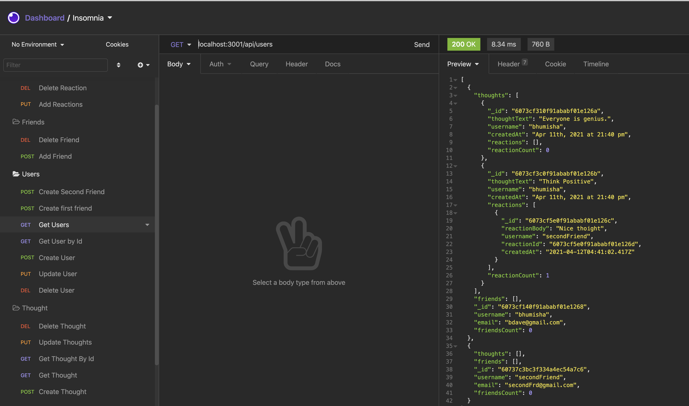

# SocialShout
    Social site is created for Users who can connect with another user as friends and also share their thoughts.
    user or other friend/users can also add their reactions on thoughts which are shared by users.

### Technology 
- MVC (Model View Controller) pattern 
    - Mongoose api which help to connect Mongo DB
    - Mongo Db
    - Node.JS
    - Express

### Installation

To install dependencies, run the following command: 

```npm install```

This will install mongoose, express libraries which are used in project.

### Project Deployment / GitHub Details

To clone the project:
- SSH - git@github.com:bhumisha/SocialShout.git
- HTTPS - https://github.com/bhumisha/SocialShout.git
 
Project Source code : https://github.com/bhumisha/SocialShout

To verify apis you need to use Insomia and check results.
This project contains below apis.

/api/users (GET, GET BY ID to get user by Id,POST , PUT , DELETE )
/api/thoughts (GET, GET BY ID to get user by Id,POST , PUT , DELETE )
/api/users/:userId/friends/:friendId ( POST AND DELETE - friends , Friend is self-reference to User)
/api/thoughts/:thoughtId/reactions ( POST to add reaction to selected thought .)
/api/thoughts/:thoughtId/reactions/:reactionId ( Delete reaction for selected thought.)

### Images

Insomnia Get Users Page which shows thoughts and reactions.


### Videos
You can find project execution videos below.

#### OverView ( GET / POST / PUT / DELETE FOR User and Thoughts)
https://drive.google.com/file/d/1V2WX1sBb54TM4NCAYjuBPRYYlY_hMoEe/view?usp=sharing

#### Friend and Reactions Apis( POST / DELETE )
https://drive.google.com/file/d/1KToKUJrL9TmUXsqiVGnxus8KnNOJDO_j/view?usp=sharing

#### Delete Reaction and Cascade deletion of User will delete thoughts and reactions.
https://drive.google.com/file/d/1mpLLCXklTjd9RLzdzVwljWAzm-bFPaxO/view?usp=sharing

### Questions
If you have any additional questions about the repo, open an issue or contact me directly at bhumishadave@gmail.com. You can fine more of my work at bhumisha